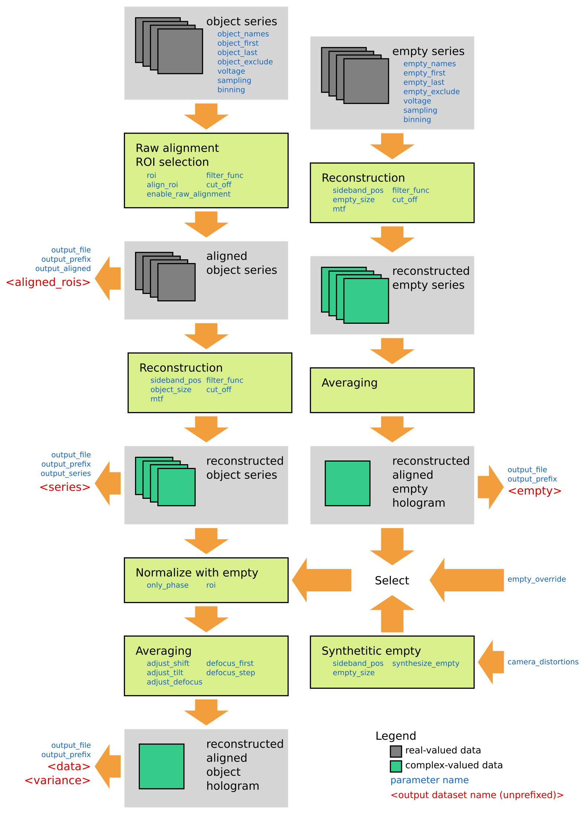

Overview
========

The *holoaverage* program is controlled by a parameter file, which is supplied to the program as argument. Section
:ref:`sec-parameters` explains the individual parameters and the format of the file itself. The general
flow of the program is sketched in the following figure, the steps of the program are explained in more
detail below.

.. _sec-object_series:

Object series
-------------

The main input to the program is a series of object holograms. Off-axis holograms interfere two regions
of the specimen. In object holograms one of these regions is the area of interest, the other is the reference
region (typically a vacuum area). This is in contrast to empty holograms (see :ref:`sec-empty_series`), where
typically both regions only contain vacuum.

The program loads the object holograms from a set of numbered files. The parameter :ref:`param-object_names`
gives these filenames and also describes how the file number is encoded within the filename.

For example, if the filenames are ``object_001.dm3``, ``object_002.dm3``, ``object_003.dm3``, ... the filenames are constructed
by combing ``object_`` with a zero padded, three digit number and the extension ``.dm3``. This would be encoded
by the value ``object_%03d.dm3`` for the parameter :ref:`param-object_names`. The ``%03d`` within the parameter
describes a zero padded, three digit decimal number.

If the filenames would be ``object.1.dm3``, ``object.2.dm3``, ``object.3.dm3``, ...  the value ``object.%d.dm3``
for the parameter :ref:`param-object_names` should be used.. ``%d`` in that case describes a simple decimal number
without any padding.

A extensive description on this number enconding is given in the `old-style formating rules of Python
<http://docs.python.org/3/library/stdtypes.html#old-string-formatting>`_.

The interval of numbers constituting the series is given by the parameter values of :ref:`param-object_first`
and :ref:`param-object_last`, which give the first and last number of range (inclusive). Additionally, it is
possible to exclude images with specific numbers from the series, for instance if one image is very noises or
otherwise unisuitable. This can be achieved by specifying these unwanted image numbers in the list
:ref:`param-object_exclude`.

For a list of supported image formats see Section :ref:`sec-file_pathes`. That section also describes, how to specify
which specific dataset of multi-dataset data formats should be used. The program itself has to know certain metadata
for the input series. These metadata are the size of one pixel, i.e. the spatial sampling rate, and the used acceleration
voltage and the camera binning (the later is needed for correction from the modulation transfer function).
The program will take these metadata from the input files (if the input file format provides these information).
Otherwise, these informations must be explicitly provided by the parameters :ref:`param-sampling`, :ref:`param-voltage`,
and :ref:`param-binning`. If these parameters are provided, the parameter values will used even if the input files also provide these data. This
can be used to override the input file information, e.g. for the case where the sampling rate in the input file is
incorrect.

.. _sec-raw_alignment:

Raw alignment and ROI selection
-------------------------------

During the acquisition of the series it may happen that the specimen drifts. These specimen drifts are detected
in the raw alignment step. The phase correlation function (see [Meyer02]_) of the central band between consecutive images
of the series is used for the detection of these drifts. For selection of the central band a low-pass filter
is needed. The *holoaverage* program uses the same cut-off frequency for this low-pass as
for the holographic reconstruction step as given by the parameter :ref:`param-cut_off`.
The :ref:`param-cut_off` is given in reciprocal nanometers.

A region of interest (ROI) from which eventually the holograms are reconstructed can be specified by the :ref:`param-roi`
parameters. The region of interest is specified by giving the ``left``, ``top``, ``right``, and ``bottom`` pixel coordinates of the
selected rectangle of the first image in the object series. The detected specimen drift over the series is used to
move the ROI rectangular in such a way, that always the same specimen region is selected. If the ROI drifts out of the
area covered by the image, the missing values are filled up by the average intensity. The program crops each
hologram of the object series to this ROI.

The raw alignment detection by default is performed in the same ROI, which is later also used for holographic
reconstruction. It is also possible, to select a different region for alignment than the region that is later
used for reconstruction, by specyfying an alignment ROI using the parameter :ref:`param-align_roi`. It is also
possible to disable the raw alignment by setting the :ref:`param-enable_raw_alignment` parameter to false.

Within the program the aligned ROIs of the object series are internally forwarded to the reconstruction step. By
default the aligned ROIs are not saved into the output file. When the :ref:`param-output_aligned` parameter is ``true``,
the aligned ROIs are also saved as dataset ``aligned_rois``.

.. _sec-holo_reconstruction:

Holographic Reconstruction
--------------------------

All (aligned) holograms are reconstructed individually. The reconstruction is performed as described in [Lehmann02]_
for each hologram:

1. The hologram is Fourier transformed.
2. The modulation transfer function (MTF) is deconvoluted from the hologram. Basically this is done by dividing
   the Fourier transformed hologram by the MTF. The MTF is passed to the program by the :ref:`param-mtf` parameter (see
   :ref:`sec-mtf` for a detailed description of the parameter).
3. The transformed data is recentered in Fourier space, such that
   the sideband is moved to the origin. For this position of the sideband (corresponding to the 2D carrier frequency)
   must be specified by the parameter :ref:`param-sideband_pos`. Please note, that this sideband position is specified
   as pixel position in the Fourier transform of the input object images (before cropping it to the specified
   region of interest).
4. A low pass filter is applied to only select the (centered) side band. For this the spatial frequency of the
   filter must be specified using the parameter :ref:`param-cut_off`. The type of filter (hard edge, Butterworth, ...) can
   be specifyed by the parameter :ref:`param-filter_func` (see description of the parameter).
5. The filtered side band is cropped to a square region of :ref:`param-object_size` pixels size (:ref:`param-empty_size` for
   reconstruction of the :ref:`sec-empty_series`). Basically the region specified by the :ref:`param-roi` parameter
   (see :ref:`sec-raw_alignment`) is rescaled to this size in the reconstructed holograms.
6. The inverse Fourier transform of the cropped region is calculated.

Within the program the reconstruced object holograms are forwarded to the averaging step. By default the individual
holograms are not saved into the output file. When the :ref:`param-output_series` parameter is ``true``,
the aligned ROIs are also saved as dataset ``series``.

Normalization
-------------

The holograms are very sensitive to distortions. These occur when the lateral positions of the
microscope's object plane (or intermediate image plane) are not uniformly mapped to the camera pixels positions.
This happens due to electron optical lens aberrations and due to non-perfect fiber optics in the camera.
The distortions typically are visible as large-scale phase variations (lens aberrations) and hexagonal patterns
(fiber optics) in the holograms.

It is common to correct these distortions by obtaining a second hologram (series) under the same microscope
conditions, but with object removed from the field of view. Within the *holoaverage* program we refer to
these holograms as "empty" holograms (see :ref:`sec-empty_series`). The normalization is achieved by
a complex-number division of the reconstructed object hologram by the reconstructed empty hologram.
This removes the effects of these distortions and also
normalizes the amplitude of the holograms (see the discussion on "reference holograms" in [Lehmann02] for details).

For the normalization step the *holoaverage* program needs a reconstructed empty hologram covering the whole
camera area. This reconstructed empty hologram must not have the same pixel size (i.e. :ref:`param-empty_size`
when the empty series is reconstructed) as the input holograms, the program will interpolate the provided reconstructed
empty hologram by Fourier padding to the area of the (uncropped) holograms. The actual region of interest as given
by parameter :ref:`param-roi` might change due to specimen drift for the indiviudal holograms over the object series.
This drift is registered in the :ref:`sec-raw_alignment` step. The program will normalize the cropped object holograms,
by taking the associated raw aligned region from the reconstructed empty hologram.

When the interference pattern does not cover the full ROI of the holograms (especially in the empty hologram),
strong artifacts might occur in this normalization step, due to singular values in the division. This artifacts
are reduced when during the normalization only the reconstructed phases are normalized, but the reconstructed
amplitudes are left as they are. This normalization of only the phases is selected by setting the parameter
:ref:`param-only_phase` to ``true``.

The *holoaverage* program allows different data to be used for normalization:

* One possiblity is to use an additional hologram series for this (see :ref:`sec-empty_series` for details).
* A reconstructed empty hologram can be explicitly provided. This option is selected, by providing a file name
  containing a reconstructed empty hologram via the :ref:`param-empty_override` parameter.
* When the camera distortions are known, they can be passed to the program using the :ref:`param-camera_distortions`
  parameter. When :ref:`param-synthesize_empty` is set to ``true`` the program will calculate a suitable reconstructed
  empty hologram for correction of these distortions instead of using experimental data.
* When none of the above possibilities is used, no normalization is performed.

.. _sec-averaging:

Averaging
---------

While in principle the holograms in a series are obtained under the same experimental conditions, these experimental
conditions are not stable over the time needed to obtain the series. In the averaging step some of these experimental
fluctuations are registered and the effects of the fluctuations adjusted, such that the holograms after correction
can be averaged. Obviously this a-posteriori alignment of the  data is the reasoning behind recording a series instead
of a single hologram with prolonged exposure.

The tracked and adjusted instabilities are:

* Biprism drift (corresponds to a change of the global phase of the individual hologram of the series).
* Hologram contrast (corresponds to a change of the global amplitude of the individual hologram of the series).
* Specimen drift (adjustment is controlled by the parameter :ref:`param-adjust_shift`).
* Defocus drift (adjustment is controlled by the parameter :ref:`param-adjust_defocus`).
* Biprism voltage drift (adjustment is controlled by the parameter :ref:`param-adjust_tilt`).

Most of these fluctuations are adjusted to their average value over the series and eventually all holograms
are averaged. For the object series also the variance for each reconstructed pixel is estimaged.
For further details on the averaging procedure see [Niermann14]_.

Additionally, the reconstructed holograms are propagated to the Gaussian defocus (even if :ref:`param-adjust_defocus` is
set to ``false``). The defocus values for the holograms of the object series are given by the parameters
:ref:`param-defocus_first` (defocus of first hologram in the series, underfocus is negative) and :ref:`param-defocus_step` (defocus increment/decrement
between consecutive holograms of the series). If this propagation should not be performed set both
parameters to zero, which is also the default value for these parameters.

The averaged reconstructed object series is written to the output file as dataset ``data``, its variance as dataset
``variance``. The averaged reconstructed empty series (if calculated) is stored as dataset ``empty``.

.. _sec-empty_series:

Empty series
------------

For the normalization step a reconstructed empty hologram is needed. The program can reconstruct and average
this hologram from a series of empty holograms along side the object-series reconstruction. As this series
does not contain an object, no alignment for specimen drift is needed. Thus, no raw alignment step is performed
on this series. As the reconstructed empty hologram is expected to cover the whole camera area, also no
cropping is performed. In the averaging step, no defocus and drift alignment nor a propagation to a certain focus is
performed.

The parameters describing the empty series, :ref:`param-empty_names`, :ref:`param-empty_first`, :ref:`param-empty_last`,
:ref:`param-empty_exclude`, and :ref:`param-empty_size`, are equivalant to their counterpart for the object series.
The averaged reconstructed empty hologram is stored as dataset ``empty`` into the output file.

.. [Meyer02] R.R. Meyer, A. I. Kirkland, O. W. Saxton, A new method for the determination of the wave aberration function for high resolution TEM, Ultramicroscopy 92 (2002) 89
.. [Lehmann02] M. Lehmann, H. Lichte, Tutorial on Off-Axis Electron Holography, Microsc. Microanal. 8 (2002) 447
.. [Niermann14] T. Niermann, M. Lehmann, Averaging scheme for atomic resolution off-axis electron holograms, Micron 63 (2014) 28

.. _sec-usage:

Usage
=====

Command Line
------------

A ``holoaverage`` command line interface is provided (make sure you're python distribution's
script directory is in the path).

The ``holoaverage`` command line program has the following syntax:

::

    holoaverage [-vV] parameter-file

    The parameter file is a JSON file. See section :ref:`sec-parameters` for details.
    If "-" is passed as parameter file name, the parameters are read from stdin.

    Options:
        -v Verbose
        -V Print version number and exit

    Examples for parameter file are giben in the :ref:`sec-tutorial`.

.. _sec-python_api:

Python API
----------

Instead of calling the program on the command line, it can be also directly invoked within python. The parameters
are passed as a dictionary object to the following function:

.. py:function:: holoaverage.holoaverage(param[, basepath=""][, verbose=0])

    Reconstruct averaged holograms. See documentation for parameter description.

    :param param: Dictionary with parameters
    :type param: dict
    :param basepath: All filenames are taken relative to this path (defaults to current directory)
    :type basepath: str
    :param verbose: Verbosity level (defaults to 0)
    :type verbose: int
