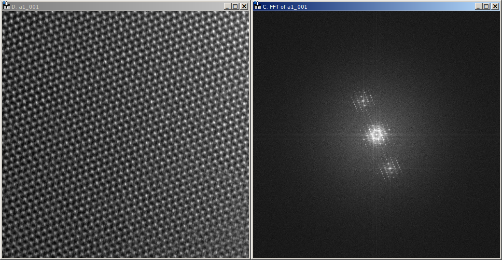
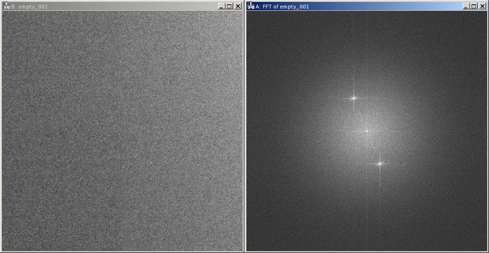
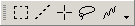
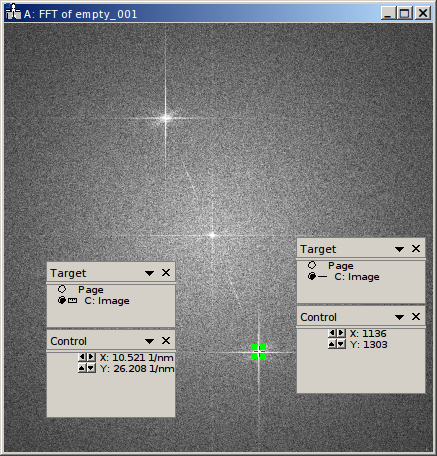
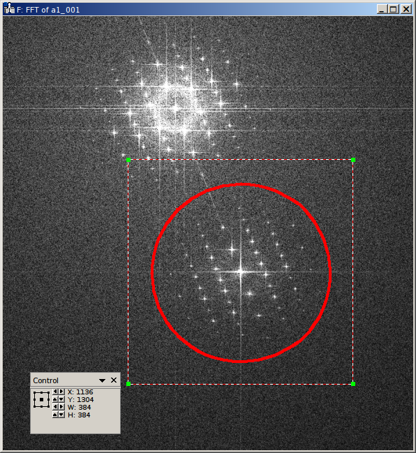
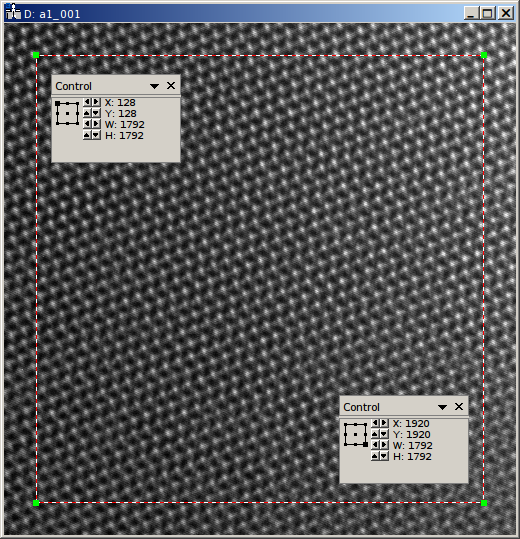
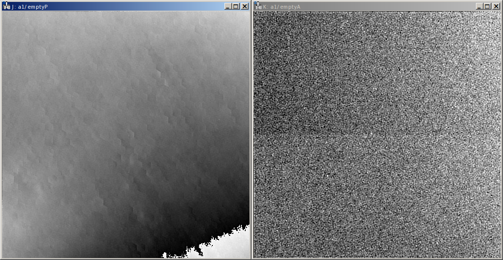
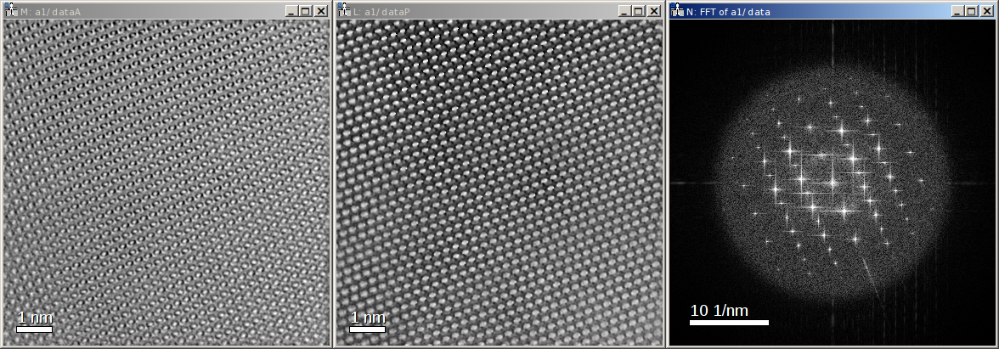
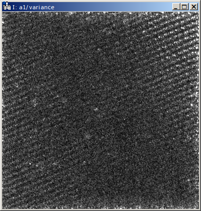

.. highlight:: javascript

.. _sec-tutorial:

Tutorial
========

This tutorial is intended as a quick-start guide to show you, how you can average and reconstruct your hologram series.
It assumes you are familiar with the general hologram reconstruction routine. A more thorough description of the
general reconstruction can be found in textbooks. For instance, the chapter on electron holography in
"Carter and Williams (Eds.), Transmission Electron Microscopy, Diffraction, Imaging, and Spectrometry, Springer" (the
companion volume) covers these aspects.

Prerequisites
-------------

Obviously, *holoaverage* must be properly installed on your local computer (see :ref:`sec-installation`).

This tutorial shows how the required parameters for the reconstruction and averaging of a hologram series
can be obtained in Digital Micrograph 2.30 by `Gatan Inc. <www.gatan.com>`_ (also known as Gatan Microscopy Suite).
Other microscopy software provides similiar capabilities to evaluate your data and can be used accordingly.

Furthermore a text editor is needed for writing and editing the parameter files provided to *holoaverage*.
You can use your favorite text editor for this (this is not the same as word processing software), just make sure
you save your files in "UTF-8" encoding (e.g. when you use Windows' notepad for this, select "UTF-8" in the encoding
field in the save dialog; see the article on `Wikipedia <https://en.wikipedia.org/wiki/UTF-8>`_, if you want to learn
more about encoding).

Data files
----------

This tutorial uses a high-resolution holographic focal series of a GaN as example. This focal series is available
as zip-archive from the DOI `10.14279/depositonce-6674 <https://doi.org/10.14279/depositonce-6674>`_.

Unzip the contents into a directory. You will see that actually two hologram
series are contained, one with the GaN crystal in one partial wave. These are the files ``a1_001.dm3``, ``a1_002.dm3``,
``a1_003.dm3``, ... .

The other hologram series was obtained without an object in the beam and is used for normalization (flat-field
correction). These are the files ``empty_001.dm3``, ``empty_002.dm3``, ... .

.. _sec-overview:

Overview
--------

The main input to the program is a series of object holograms. Off-axis holograms interfere two regions
of the specimen. In object holograms one of these regions is the area of interest, the other is the reference
region (typically a vacuum area). This is in contrast to empty holograms, where
typically both regions only contain vacuum.

The program performs roughly these steps:

    1. Reconstruction of empty hologram series
    2. Alignment and averaging of the reconstructed empty holograms
    3. Raw alignment of the object hologram series
    4. Reconstruction of the object hologram series
    5. Flat field correction of the reconstructed object holograms by the averaged empty hologram
    6. Alignment and averaging of the reconstructed object holograms

The alignment and averaging steps of both hologram series are done iteratively. Details on the program flow are
given in the section :ref:`sec-overview`. Details on the whole alignment procedure can be found in

        | T. Niermann and M. Lehmann
        | Averaging scheme for atomic resolution off-axis electron holograms
        | Micron 63 (2014) 28-34
        | doi: `10.1016/j.micron.2014.01.008 <http://dx.doi.org/10.1016/j.micron.2014.01.008>`_

The empty hologram series is only aligned for a global amplitude and phase factor (effects of filament instability).
Four iterations of the averaging loop are performed. If enabled (see :ref:`param-adjust_tilt`) it is also aligned for
the drift of biprism voltage.

The object hologram series is additionally aligned for specimen drift (which can be disabled by
:ref:`param-adjust_shift`), and focal drift (if enabled by :ref:`param-adjust_defocus`).
Seven iterations of the averaging loop are performed, the focal drift alignment is only done in the last three
iterations.

Despite the name of the above mentioned paper, the averaging scheme also works for other kind of holographic
reconstructions, e.g. medium resolution holography, or geometric phase analysis.

Creating the parameter file
---------------------------

Create a text file in the directory, where you unzipped your data files.
The text file will contain the parameters used for the reconstruction and averaging.
Copy the following text into this file and save it under the name ``holoaverage-a1.json``. You can choose the name of
the parameter file freely, however we will assume you called it ``holoaverage-a1.json`` in the following.
We will discuss the meaning of the most important parameters in the following.
A thorough reference for all parameters can be found in the Section :ref:`sec-parameters` of the
documentation. Lines beginning with double slashes (i.e. ``//``) are comments and are ignored by the program.

::

    {
        // Path of hologram files (using printf format, integer argument). Required.
        "object_names" : "a1_%03d.dm3",

        // Index of first hologram.
        "object_first" : 1,

        // Index of last hologram. Required.
        "object_last" : 20,

        // Same (name, first index, last index) for "empty" holograms.
        "empty_names" : "empty_%03d.dm3",
        "empty_first" : 1,
        "empty_last" : 20,

        // Sampling (nm/px) of object holograms.
        // Defaults to value in data files.
        "sampling" : 0.00519824,

        // Voltage in kV. Default to value recorded in data files.
        "voltage": 300,

        // Defocus of first hologram (i.e. object_first) in nm. Defaults to 0.
        "defocus_first" : 20.0,

        // Defocus step size in nm. Defaults to 0.
        "defocus_step" : -2.0,

        // Size (in px) used for reconstruction of "empty" holograms. Required.
        "empty_size" : 512,

        // Size (in px) used for reconstruction of "object" holograms Required.
        "object_size" : 384,

        // X, Y Position of sideband in FFT pixels (origin is in center). Required.
        "sideband_pos" : [1136, 1304],

        // Reconstruction region in pixels (L, T, R, B). Defaults to full region.
        "roi" : [128, 128, 1920, 1920],

        // Region for raw alignment in pixels (L, T, R, B). Defaults to roi.
        //"align_roi" : [256, 256, 1536, 1536],

        // Disable raw alignment. Raw alignment is enabled by default.
        //"enable_raw_alignment" : false,

        // Output file name (will be HDF5 file). Required.
        "output_name" : "a1.hdf5",

        // Mask type (see FilterFunction for details). Defaults to "EDGE"
        // "filter_func" : "EDGE",
        "filter_func" : ["BUTTERWORTH", 14],

        // cut off frequency in 1/nm (q_max). Required.
        // Also used as low-pass frequency for raw alignment
        "cut_off" : 14.5,

        // Parameterization for MTF
        "mtf" : [["CONSTANT", -2.25536738e-02],
                 ["LORENTZIAN", 1.02543658e-05, 1.15367655e-04],
                 ["LORENTZIAN", 2.49224357e-02, 5.35262063e-02],
                 ["GAUSSIAN", 4.60461599e-01, 4.36842560e+02]],

        // Correct phase by empty phase only (true), or full complex reconstruction (false).
        // Defaults to false.
        "only_phase": false,

        // Optimize defocus. Default: false
        "adjust_defocus" : true,

        // Optimize shift. Default: true
        "adjust_shift" : true
    }

Setting the input files
-----------------------

At first the file names for the input files must be provided. Here we have two series, the series of the object
holograms, i.e. ``a1_XXX.dm3``, and the series of the empty holograms, i.e. ``empty_XXX.dm3``. The first parameter
:ref:`param-object_names` describes, how the object holograms are named:

::

        "object_names" : "a1_%03d.dm3",

Our holograms have filenames starting with ``a1_``, followed by a three digit number, and have the extension
``.dm3``. The ``%03d`` in the filename describes, how the number is encoded in the filename (here 3 digits, zero
padded). If our filenames, for instance, would be called ``a1.1.dm3``, ``a1.2.dm3``, ``a1.3.dm3`` ..., we would set
the :ref:`param-object_names` parameter to ``a1.%d.dm3``, where the ``%d`` would mean just a decimal number with as
many digits as needed. If you interested, how to encode other numbers, look at the `old-style formating rules of python
<http://docs.python.org/3/library/stdtypes.html#old-string-formatting>`_.

The next two parameters give the range of numbers contained within the series:

::

        "object_first" : 1,
        "object_last" : 20,

Here, the series starts at index ``1`` and ends at index ``20`` (inclusive).

The next parameters describe, how the empty hologram series is named. These parameters follow the same conventions
as the parameters described above.

::

        "empty_names" : "empty_%03d.dm3",
        "empty_first" : 1,
        "empty_last" : 20,

The microscope parameters
-------------------------

The example holograms provided here are not correctly calibrated. The holograms were recorded using a non standard
setup of the microscope, which is not correctly identified by the recording software. For this reason it is needed to
provide the correct calibration to the *holoaverage* program. The correct calibration is specified by the parameter
:ref:`param-sampling` and gives the size of one pixel in nanometers. When the :ref:`param-sampling` parameter is
present, it overrides any calibrations from the image files. If the parameter is not present in the parameter file, the
calibrations are taken from the image files.

Here, the material recorded in the holograms is well known, thus the reflections in the Fourier transforms of the
holograms were used for calibration. The following setting makes the correct calibration known to the program

::

        "sampling" : 0.00519824,

If you are used to Digital Micrograph, you can find the sampling of an image under "Calibrations" in the "ImageDisplay..."
dialog available, when you right-click an image.

The *holoaverage* program also has to know the acceleration voltage of the microscope. In this case, it could also read
it from the image files itself (i.e. omitting this parameter). Nevertheless, we provide it here in kilovolts:

::

        "voltage": 300,

In this case the object series is a holographic focal series, which means the defocus is changing from hologram to
hologram. The *holoaverage* program will propagate all holograms to the Gaussian focus. The parameter
:ref:`param-defocus_first` gives the defocus of the first hologram (given by :ref:`param-object_first`) in nanometers
(overfocus is positive). The parameter :ref:`param-defocus_step` gives the increment / decrement of the defocus between
two consecutive images of the series. Here the first hologram is taken with a defocus of (estimated) 20 nanometers, the
second with a defocus of (estimated) 18 nanometers. So the defocus is decremented by 2 nanometers, between two
consecutive acquisitions:

::

        "defocus_first": 20,
        "defocus_step": -2,

Please note, that the reconstructions are propagated to the Gaussian focus (defocus 0 nm), as given by the defocus
parameters above. When wrong parameters are provided, this the target focus is not the Gaussian focus. The resulting
holograms can nevertheless propagated to a different focus afterwards. If no defocus parameters are provided, no
propagation is performed, and the program averages all reconstructed holograms as they are.

The final parameter describing the microscope, is the modulation transfer function (MTF) of the camera. This
MTF must be provided to the *holoaverage* program. As it is practice in most labs to describe the MTF as a
parameterization of some simple functions, this parameterization can be directly provided to the program. This
description is documented in Section :ref:`sec-mtf`. For this tutorial we simply pass the provided MTF to the
program. If you don't know the MTF of your detector, you can omit this parameter in the parameter file. Obviously
no MTF correction is performed in this case.

::

        "mtf" : [["CONSTANT", -2.25536738e-02],
                 ["LORENTZIAN", 1.02543658e-05, 1.15367655e-04],
                 ["LORENTZIAN", 2.49224357e-02, 5.35262063e-02],
                 ["GAUSSIAN", 4.60461599e-01, 4.36842560e+02]],

Reconstruction parameters
-------------------------

The *holoaverage* program has to know the carrier frequency of your hologram. This carrier frequency is most
conveniently identified as the position of the sideband in one of the Fourier transformed empty holograms. In Digital
Micrograph you can use the *point ROI tool*. This is the central tool button in the *ROI toolbar* looking like a cross-hair
(if this toolbar is not visible, enable it in the "Toolbars" tab of the "Window/Customize..." dialog):

Selecting the center of the desired sideband allows to read out the coordinates of the sideband. Which of the two
sidebands is the correct one, depends on the convention you use for your phase and on which side of the biprism your
object was located. We use the convention that the phase shift increases with increasing specimen thickness. In this
case, the correct sideband is the one, which is located on the side of the biprism filament, where the **reference**
wave passed. In this GaN example, the biprism filament was oriented in 8 to 2 o'clock orientation. The object partial
wave passed the top side of the filament, the reference partial wave the bottom side. Thus we select the **lower** side
band here, located in the 5 o'clock position.

With the marker positioned on the sideband, the coordinates of the sideband can be read in the "Control" panel (if not
visible, enable it in the "Window/Floating Window" drop down menu). The "Control" panel actually has two modes, either
showing the position in calibrated units (see left part of the above figure) or as pixel position (right part of the
above figure). You can toggle the mode by clicking on the little scalebar in the "Target" panel (in the
figure above directly left to "C:Image"). For the parameter file we need this position **in pixels**. This position
is given by the :ref:`param-sideband_pos` parameter as X and Y coordinates:

::

        "sideband_pos" : [1136, 1304],

When the sideband is masked out in the reconstruction step, the size and form of the aperture used must be specified.
For this the radius of the mask and the type of the mask are needed. The radius of the mask is chosen, such that the
sideband is well separated from the central band, and all reflections are included within the radius.

In the figure above, the radius of the red circle is 14.5 1/nm (measured using the Fourier transformed image, after
recalibration; see ``sampling`` parameter above). This radius in reciprocal nanometers is given by the
:ref:`param-cut_off` parameter. Here, we use an aperture with a soft edge, which is specified by providing the string
``"BUTTERWORTH"`` and the order of the Butterworth function (here ``14``) as :ref:`param-filter_func` parameter. For a
hard edge, simply provide the string ``"EDGE"`` instead of the squared parenthesis.

::

        "cut_off" : 14.5,
        "filter_func" : ["BUTTERWORTH", 14],

Due to this masking in Fourier space, the reconstructed holograms will have a lower resolution than the original
holograms. Thus the resulting data arrays can made smaller, which also speeds up the averaging process. It is sufficient
to make the result arrays only as large, that the mask defined above is fully contained within them. As we use a soft
edge we give here a little leeway and make the result array 384 pixels large (for performance reasons you should
prefer sizes with small prime factors here):

::

        "object_size" : 384,

Another parameter needed for the reconstruction is the region of the object holograms, which should be reconstructed.
If the specimen is drifting strongly, not the whole region of the holograms might be present in all acquisitions of
the series. In this cases it might be meaningful to only reconstruct a sub region of the hologram:

This region is provided to the image program as :ref:`param-roi` parameter. This region of interest (ROI) is defined
as rectangular area in the first object hologram. During the raw-alignment step of the reconstruction, this region
is tracked and the same sub-region is extracted from the consecutive object holograms. The left, top, bottom, and right
borders are provided to the program in pixel coordinates. As shown in the above figure, the "Control" panel can be used
to determine these coordinates, by clicking on the respective corners of the rectangle in the panel. Here only the
central 7/8 of the holograms are used, the coordinates are given as left (128), top (128), right (1920), and bottom (1920):

::

        "roi" : [128, 128, 1920, 1920],

If this parameter is omitted, the whole hologram area is used for reconstruction.
Please note, that also the region used for raw alignment can be specified explicitly using the :ref:`param-align_roi`
parameter. Alternatively, the raw alignment can be disabled by setting the :ref:`param-enable_raw_alignment` parameter
to ``false``.

The empty hologram series is always reconstructed using the full image region. This is done, for two reasons. For one,
there is no specimen drift in empty holograms. For another, the reconstructed empty hologram is used to remove some
distortions of the camera and the projection system of the microscope. This are fixed to the camera pixels.
The normalization of the object holograms is made with the corresponding sub-region (tracked for
specimen drift) of the reconstructed empty hologram. This requires the empty hologram reconstruction to cover the whole
camera area.

The reconstruction size of the empty holograms can be chosen independently, and is made a
little bit larger here:

::

        "empty_size" : 512,

If the whole hologram area is reconstructed in the object series, the ``empty_size`` parameter should be chosen
identically to the ``object_size`` parameter.

Output and averaging
--------------------

One has to select which drifts are tracked in the averaging step. By default only specimen drift is
tracked and adjusted. Here we also want to track and adjust for focal variations. These adjustments are
selected by the following parameters.

::

        "adjust_defocus" : true,
        "adjust_shift" : true

When the interference pattern is smaller than the area of the hologram, the amplitude normalization of the flat-field
correction might produce strong artifacts. In these cases, it might be beneficial to only normalize the phases of the
reconstructions. This can be adjusted by the :ref:`param-only_phase` parameter. You should also consider to use the
:ref:`param-align_roi` parameter in cases of smaller interference patterns.

::

        "only_phase": false,

Eventually, the filename of the output file must be provided by the :ref:`param-output_name` parameter. The output will
be always HDF5 files, the contents of these files is described in Section :ref:`sec-outputs`.

::

        "output" : "a1.hdf5",

Starting the program
--------------------

When correctly installed, the program should be executable from the console. Change into the directory, where your
tutorial data files are located, using the ``cd`` command of the console. Below it is assumed this directory is
called ``directory-with-data-files``, so adjust the path ``directory-with-data-files`` below accordingly. Note, you may have
to enter the absolute path to the directory. Windows user might also have to switch the current drive they are working
with; for that use the desired drive letter, followed by a colon as command (e.g. ``D:``, if the data is located on
drive ``D:``) before using the ``cd`` command.

.. code-block:: none

        cd directory-with-data-files

Now call the holoaverage program and pass the name of the parameter file ``holoaverage-a1.json`` to it as argument.
The switch ``-v`` is optional and enables verbose output.

.. code-block:: none

        holoaverage -v holoaverage-a1.json

The program now should start with the reconstruction and averaging and should output something like:

.. code-block:: none

    Loading parameters from
            /home/niermann/PycharmProjects/holoaverage/example/holoaverage-a1.json
    Loading...
            20 datasets, shape=(2048, 2048), dtype=int16
            [00] GaN_holographic_focal_series/empty_001.dm3
            [01] GaN_holographic_focal_series/empty_002.dm3
            [02] GaN_holographic_focal_series/empty_003.dm3
            [03] GaN_holographic_focal_series/empty_004.dm3
            [04] GaN_holographic_focal_series/empty_005.dm3
            [05] GaN_holographic_focal_series/empty_006.dm3
            [06] GaN_holographic_focal_series/empty_007.dm3
            [07] GaN_holographic_focal_series/empty_008.dm3
            [08] GaN_holographic_focal_series/empty_009.dm3
            [09] GaN_holographic_focal_series/empty_010.dm3
            [10] GaN_holographic_focal_series/empty_011.dm3
            [11] GaN_holographic_focal_series/empty_012.dm3
            [12] GaN_holographic_focal_series/empty_013.dm3
            [13] GaN_holographic_focal_series/empty_014.dm3
            [14] GaN_holographic_focal_series/empty_015.dm3
            [15] GaN_holographic_focal_series/empty_016.dm3
            [16] GaN_holographic_focal_series/empty_017.dm3
            [17] GaN_holographic_focal_series/empty_018.dm3
            [18] GaN_holographic_focal_series/empty_019.dm3
            [19] GaN_holographic_focal_series/empty_020.dm3
    Reconstructing...
            . . . . . . . . . . . . . . . . . . . .
    Optimizing after iteration 0
            [NN] sx[px] sy[px] tx[1/px] ty[1/px] def[nm] Ampl   Phase  Error
            [00]  0.000  0.000  0.00000  0.00000   0.000 1.0000 +0.802 2.403186e+09
            [01]  0.000  0.000  0.00000  0.00000   0.000 1.0000 -0.672 2.365460e+09
            [02]  0.000  0.000  0.00000  0.00000   0.000 1.0000 -1.478 2.599819e+09
            [03]  0.000  0.000  0.00000  0.00000   0.000 1.0000 -2.849 2.534287e+09
            [04]  0.000  0.000  0.00000  0.00000   0.000 1.0000 -1.102 2.451658e+09
            [05]  0.000  0.000  0.00000  0.00000   0.000 1.0000 +0.163 2.365165e+09
            [06]  0.000  0.000  0.00000  0.00000   0.000 1.0000 +0.439 2.400905e+09
            [07]  0.000  0.000  0.00000  0.00000   0.000 1.0000 -0.745 2.470458e+09
            [08]  0.000  0.000  0.00000  0.00000   0.000 1.0000 +0.303 2.364581e+09
            [09]  0.000  0.000  0.00000  0.00000   0.000 1.0000 +1.830 2.513006e+09
            [10]  0.000  0.000  0.00000  0.00000   0.000 1.0000 +1.208 2.377789e+09
            [11]  0.000  0.000  0.00000  0.00000   0.000 1.0000 -0.781 2.302518e+09
    ...

and so on. Eventually it should output something like:

.. code-block:: none

        Iteration   7: total error=7.501946e+07

This error number should go down and converge to a stable value within the last iterations.

Results
-------

After the program succeeded the outputs can be found in the output file as specified by the :ref:`param-output_name`
parameter. In the present example the outputs are in the file ``a1.hdf5`` in the same directory as the parameter file.

If you are using Digital Micrograph, there is also a plugin to read HDF5 files, which can be found at
`<https://github.com/niermann/gms_plugin_hdf5/releases>`_. These outputs should be checked for artifacts.

The averaged empty reconstruction is contained in the HDF5 file as dataset ``empty``. It should be more-or-less
homogeneous. If the interference only covers the camera
partially, only the area of the interference pattern should be homogeneous obviously. Also Fresnel fringes might cause
small deviations, the central area of the interference region should be homogeneous nevertheless. Here the phase (left)
and amplitude (right) of the empty example series are shown.

The patterns present in the phase are the aforementioned camera and projection distortions.

The reconstructed object series can be found in the dataset ``data`` of the HDF5 file. Here the amplitude (left), phase
(center), and Fourier transform (right) of the averaged reconstruction are shown:

Please note, that this object hologram doesn't show the GaN structure perfectly, due to residual aberrations. But since
you now have reconstructed the full complex information you can now correct for aberrations a-posteriori.

Finally, the variance estimation of the averaging step should be checked. The reconstruction shown above represents
the average of the object series. When the object series is averaged, also the variance of the object series
(drift corrected and propagated to the Gaussian focus) is checked. This variance for each pixel of the reconstructed
object hologram is provided in the dataset ``variance`` of the HDF5 file. Small variances (compared to the
amplitude values) are to be expected especially at positions with strong contrasts (specimen edges etc.). Also
hot pixels of single holograms might pop up in the variance array. However, strong variance indicate a problem with
either the data or the averaging process.

